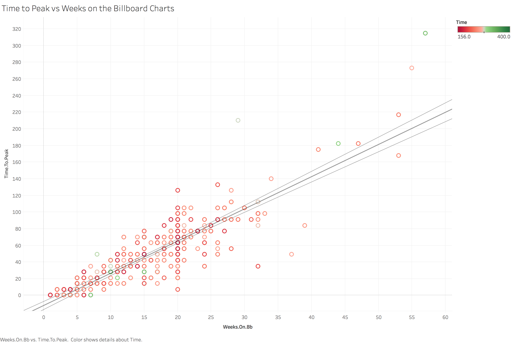
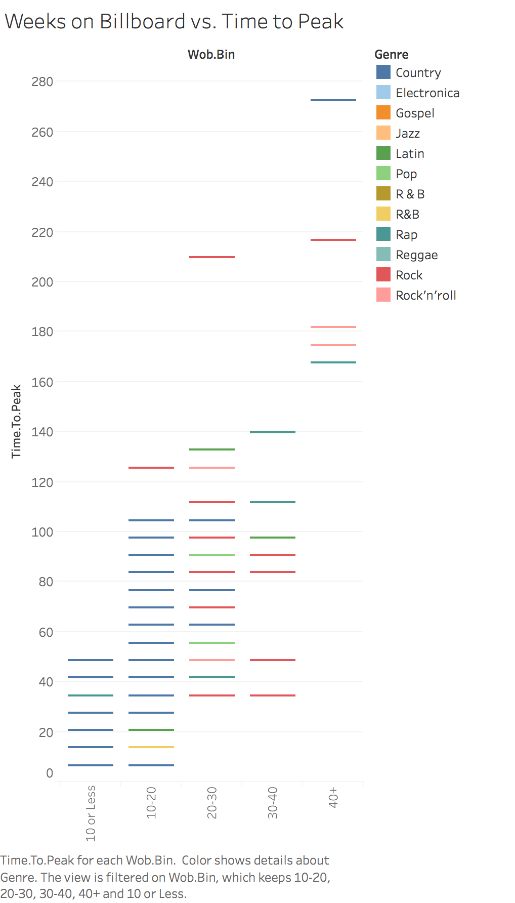
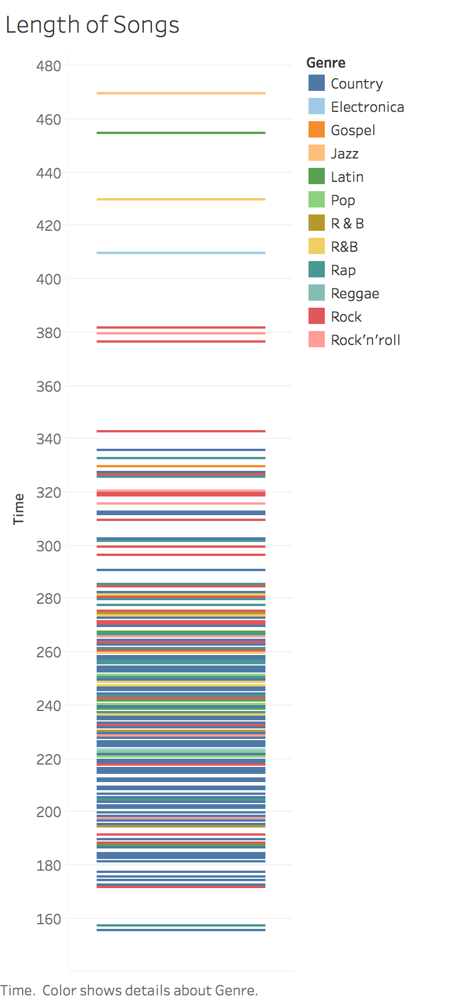

#Summary

This is the 2nd project for General Assembly's Data Science Immersive course.  The goals for the project were to do some cleaning and exploratory data analysis on a Billboard Charts data set from the year 2000.

The data describes the songs that peaked on the Billboard charts for the year 2000. According to information found on Wikipedia: "chart rankings are based on sales (physical and digital), radio play and online streaming. Descending songs are removed from the chart if ranking below number 25 after 52 weeks."

#Data

There are 317 rows with features along 83 columns.
The columns are:
year - year
released artist.inverted - name of the artist
track - name of the track
time - length of the song
genre - genre of the song
date.entered - the date the song entered the Billboard charts
date.peaked - the date the song peaked on the Billboard charts
x1st.week through x76th.week - the ranking of the song on the Billboard charts

The genres were: Country, Electronica, Gospel, Jazz, Latin, Pop, R&B, Rap, Reggae, Rock and Rock'n'Roll.  Rock had the most songs with nearly 1/3 of the songs, 103 songs.   The next most frequent genres were Country, Rap, and Rock'n'Roll.

#Goal

On first glance of the dataset it is clear that at least the genre is mislabeled.  Because of this I don't have an exact hypothesis because I don't trust the data. But I am hoping to find some kind of relationship between song length and rankings or at least duration on the Billboard charts.  At this point the goal is to clean the data and change it into manipulatable data types.

#Visualization

This demonstrates some kind of relationship between Time to Peak and Highest Rank.  But not a very strong one.  The colors are genres but those as mentioned before are mislabeled.  It would seem that there is a relationship between a song rising quickly and reaching a higher rank on the Billboard charts.

Another way to visualize the same thing.

While this graph doesn't really show any relationships, it does give a good representation of the length of songs that made it to the charts in 2000.  The average song length for a song that charted was roughly 240 seconds or 4 minutes.

#Conclusion

I've decided to only chart a few relationships because I haven't found anything insightful in any of the data.  The best way to group the data was based upon genre which was mislabeled.  The second option was length of the song but that was found to not have any particular kind of relationship with any other data.  I looked into the impact the date the song entered into the charts had which was so varied as to not show anything useful.

In conclusion this data was incomplete.  We cannot tell what makes a good song because we don't really have any "bad" songs.  We can't really infer anything useful from the data beyond what it is mostly incorrectly telling us because there isn't enough information to draw from in order to group the data in an effective manner.  What I learned from this exercise was to not trust data and to question every aspect of it, no matter the source.  
