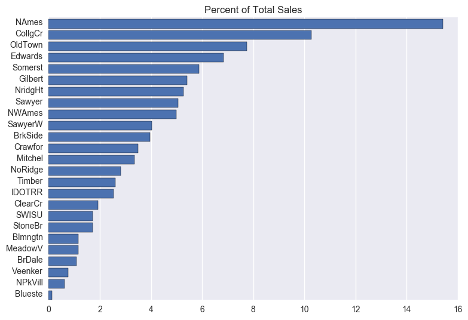

# Summary

I have been given access to set of data describing the Ames, Iowa real estate sales details from 2006-2010.  The task is to create a model for a real estate firm based upon a set of housing features that accurately predicts sales price.

The goal is to refine the data to a point where the predictive qualities of the model based upon it are as accurate as the data will allow.

Additional tasks are to provide an analysis of neighborhoods, in regards to where the most sales are taking place and where the most expensive houses are located.

# Data

The original data contains 1460 listings with 81 features each.
I have been asked to save money for the company by limiting the amount of features included in the analysis so those aspects wouldn't need to be collected in the future.

I have been asked to limit the features to:
'LotArea','Utilities', 'Neighborhood','BldgType', 'HouseStyle', 'OverallQual', 'OverallCond','YearBuilt', 'YearRemodAdd', 'RoofStyle', 'RoofMatl', 'GrLivArea', 'FullBath', 'HalfBath', 'BedroomAbvGr', 'KitchenAbvGr','MoSold','YrSold', 'SalePrice'

This limited the features to 18 with Sales Price being our target feature to predict.

An explanation of the different features can be found [here](https://www.kaggle.com/c/house-prices-advanced-regression-techniques/download/data_description.txt).

# Visualization

Its clear from this chart that NAmes: North Ames has had the highest percentage of sales of all the neighborhoods. The Blueste: Bluestem neighborhood has the least amount of sales.

This chart has the Sales Prices on the Y axis with the neighborhoods on the X axis.  It shows us the range of prices per neighborhood, as well as outliers, and gives us a sense of average price per neighborhood.

We can tell that the most expensive neighborhoods are NoRidge, NRidgHT, and StoneBR.  

The other things I found were that sales did not seem to change in volume year over year, which was surprising being that the data covers the recession.  The economy must not be too volatile in Ames.  I also found that more than 25% of the homes sold between 2006-10 were built after the year 2000.  

# Model and Data Cleaning

Without doing too much to clean up the data I got a model that predicted about 75% of the variability in the Sale Price.  I wanted to increase that so I decided to make some decisions based upon both statistics and my background in real estate sales.

The first thing I did was to get rid of any listings over an acre of land being that the majority of homes have a lot size of about 1/4 of an acre.  Next I removed homes with over 3000 square feet because the average home in the US rarely gets above 2500 and Ames is no different with an average living area of 1500 square feet.

I then took out any really different homes.  Homes with no bathrooms, kitchens, bedrooms, and homes with a high number of any of those.

In total I removed about 70 listings.

This brought my predictive model to a point where it was predicting the variability in sales price over 87% of the time.

# Conclusion

Ames, Iowa with a motto of "Smart Choice" seems to be just that.  According to the latest info the average price per square foot in Ames, Iowa is a few dollars higher than for the rest of the state.  Being that it is such a college town with Iowa State University located there and it being the 8th largest city in the state, these prices seem "smart" being that is has much higher demand than the rest of the state.  The industry of the town also wasn't strongly effected by the recession which also makes it attractive.  

The average home in Ames has about 1/4 an acre of land, 1500 square feet, 1.5 baths, 3 bedrooms and sells for roughly 180k.  If you have any questions about the work or would like to run the model yourself, my jupyter notebook can be found [here](https://git.generalassemb.ly/schmidtscf/project-3-house-prices/blob/master/Ames%2C%20Iowa%20Real%20Estate.ipynb)
