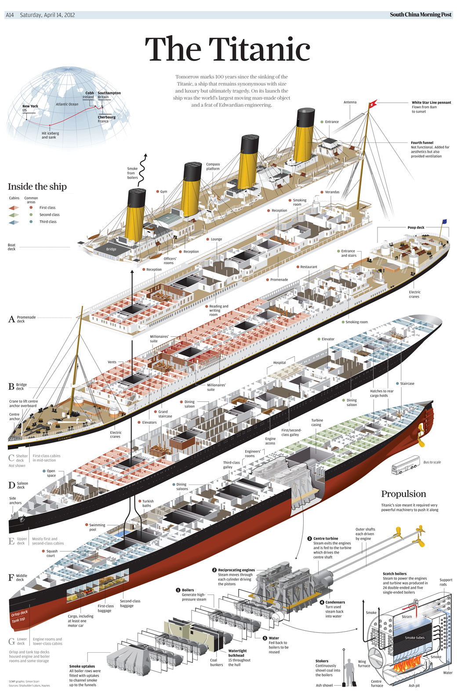
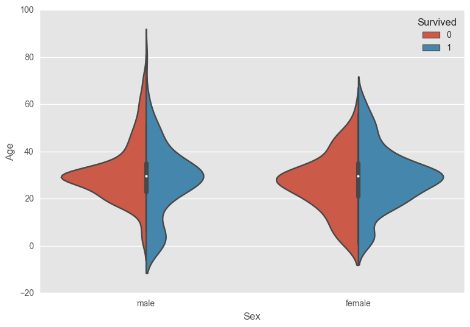
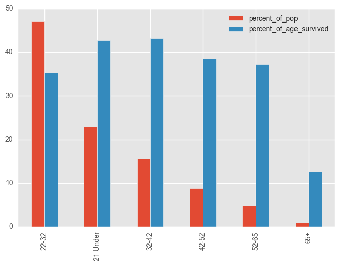
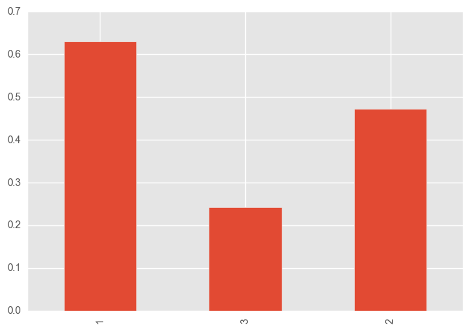

# Summary

The fifth project from General Assembly: A disaster management firm has asked me to take a look into the information we have on the Titanic disaster to see what kind of insights a data science workflow can have for applications on future disaster situations.

# Data

The original data has information on 891 passengers, which already raises some eyebrows.  The ship had 1,343 passengers total, of which 705 survived, which is roughly 52% survival rate.  My dataset has 549 of 891 passengers surviving which is a rate of 61%.  It immediately makes me wonder what the collection process was, aside from the fact that this information comes from over a century ago.  

The features I have to inspect are Passenger ID, Pclass (ticket class), Name, Sex, Age, SibSP (# of siblings/spouse aboard), Parch (# of parents/children aboard), Ticket number, Fare, Cabin, and Embarkation port.  Things like passenger ID, Name,  and Ticket/cabin number are so specific that they aren't helpful to a greater analysis so I will ignore these features.

There were a few missing ages but I imputed those with the mean of the ages.  

# Descriptive analysis

Of the passengers that didn't survive 85% were male and 15% were female.  The ones that did survive were 68% female.  

Age was also an important factor in deciding survival rates.  Out of the data I had the highest count of survival was the 22-32 age range, with 148 people surviving.  This isn't particularly insightful being that they accounted for 47% of the population.  The chart below gives a better understanding of the impact of age.  The red columns represent the percent of the population, while the blue represent the percent of that age group that actually survived.

From this chart we can tell if you were under 21 or between the ages of 32-42 you had the greatest chance of surviving, a little over 42% each.  The lowest rate of survival was actually the 22-32 age range with a survival rate of 35% (ignoring the 65+ age group because there were so few passengers in that age range to infer anything).

The above chart shows the percent survival rate for each class.  For 1st class, 62% survived, for 2nd class, 47% surived, and for 3rd class, 24% survived.  In short the better the class the more likely you were to survive.  

# Conclusion
Through this analysis of the Titanic data set I was able to tease out some interesting information. The features that impacted survival rate the most were sex (women were more likely to survive), Fare (the more you paid the likelier you would be to survive probably based upon where your cabin was), and Age (if you were under 21 or between the able bodied ages of 32-42 (more likely to buy higher fare tix as well) you were more likely to survive).

I have built a predictive model using a Random Forest Classifier, a model which is made up of multiple decision trees. To put it simply one decision tree splits the data based upon information gained by the split and does this until leaf nodes, end points, are created that define the most pure classification groups. My model simply took many decision trees and averaged their outcomes to come up a model that was able to predict the survival rate about 82% of the time. That seems well and good but our recall score, a measure of how many predictions were accurate out of the population of that class, was accurate a great 94% of the time in regards to survivors but the more important aspect was the fact it was only right 8 out of 10 times predicting the passengers that perished. That needs to be improved, so I changed the decision threshold to 40%. This basically means that more people will be predicted to perish, which allows for better planning. One always wants to plan for the worst case scenario vs the best.

In regards to providing actionable insights into disaster management my results aren't incredibly helpful, more just descriptive. There is no practical application to knowing that being female increases your likeliness of survival, nor increased ticket price, nor age. One simply cannot mitigate deaths by making the passengers of a ship only of a certain age, sex, and pay more.

 However, there is some insight to be gleaned from the fact that the passenger class was impactful simply because of ship layout. It is clear the lower class cabins need a better disaster plan map in order to mitigate their losses. This would be the most important understanding that came from this analysis.

My jupyter notebook can be found [here](https://github.com/schmidtscf/Titanic/blob/master/Titanic.ipynb)
